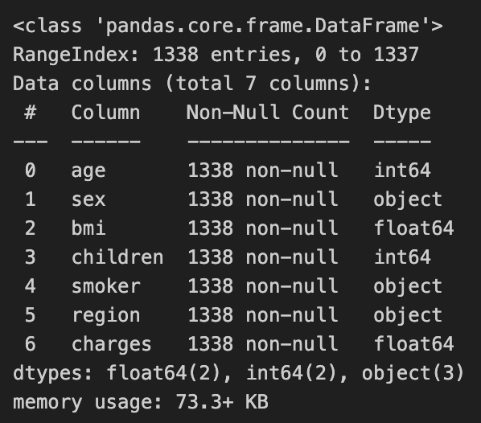
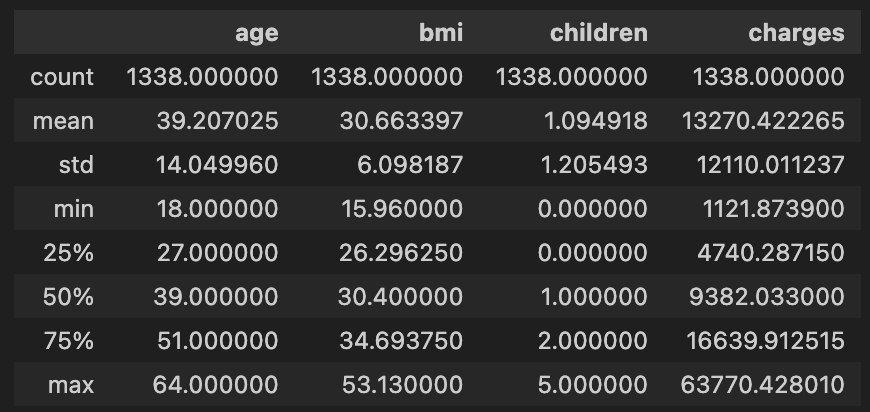

# Insurance Exercise

This is an exercise repository for analyzing data in Python
using various packages.  It is not meant to be thorough
or deep, but just a first attempt to apply the skills
obtained so far on an unfamiliar data set.

The goal has been set to create a few hypotheses from
looking at the most superficial information on the data,
investigating a bit using visualization tools as well
as some of the basic `pandas` capabilities, and coming
to conclusions with respect to those hypotheses.  In
the process, the student was meant to become familiar
with both GitHub as a platform itself as well as the
workflow of creating and finishing a data analysis project.

# The Data

The source data is a `.csv` file stored in the `data/`
folder, called [insurance.csv](./data/insurance.csv).

It can be downloaded from
[https://www.kaggle.com/datasets/mirichoi0218/insurance?select=insurance.csv](https://www.kaggle.com/datasets/mirichoi0218/insurance?select=insurance.csv),
where it is published under the
[Database Contents License (DbCL)](https://opendatacommons.org/licenses/dbcl/1-0/).

As an overview, here are the basic information and descriptive
statistics of the data as computed there:





# Overview

## Quick Start

The actual analysis starts in notebook
[02-making-hypotheses.ipynb](./02-making-hypotheses.ipynb).

If the reader is interested in how the auxiliary tool set
has been constructed that resides in the `setup` package,
the [01-setup.ipynb](./01-setup.ipynb) notebook is the one
to start with.

The final hypotheses from the second notebook get verified
in [03-superficial-insight.ipynb](./03-superficial-insight.ipynb),
and the subsequent notebooks dig deeper into the prediction
of the insurance charges and influential factors.

This investigation concludes in
[09-offsets-and-more-insights.ipynb](./09-offsets-and-more-insights.ipynb),
and the last one, [10-outlook.ipynb](./10-outlook.ipynb), uses
the insight obtained up until this point to reveal finer
structures and observations without pursuing them any further
or commenting in detail on any of the (rich) graphs created
in there.

## Reading Order

The repository contains ten notebooks that are interconnected via
links.  The reader can jump through them in the suggested order
by using those directly in there.  Mind that the numbering indicates
the order in which they have been created and the depth in which
they analyze the data, not the order in which they are meant to
be read.

In particular, the setup notebook can be skipped entirely
without losing any major insight.  What happens in there is merely
the construction of auxiliary tools that will be frequently used
in all the other notebooks.  For that reason, the Python code
developed in there has been exported into and extended in the
local Python package `setup`.  All other notebooks will frequently
import constructs and auxiliaries from that one in order to
process the data frames concisely and produce consistent graphics.

Another point where the notebook numbering can be misleading is
in the notebook "05-fitting-df_low.ipynb".  Somewhere in the middle,
it forks off into the three "0...-linear-regression-using-..."
notebooks that illustrate the same task by using three different
packages.  At the end of the last one, the reader gets re-directed
to the fifth to finish the analysis and finally to the ninth,
which tackles the final topic covered in this repository.

# Getting The Repo

## Cloning the Repo

```zsh
git clone <SSH-Key>
cd Insurance_Exercise
```

## Setting Up Your Virtual Environment

```zsh
pyenv local 3.11.3
python -m venv .venv
source ./.venv/bin/activate
```

### Checking and Fixing Your Python Version

```zsh
python --version
```

If the output differs from your local version (3.11.3),
then run the following line and check again:

```zsh
eval "$(pyenv init -)"
```

Now, your Python executable should reflect the
correct version.

## Installing the Python Packages

```zsh
pip install --upgrade pip
pip install -r requirements.txt
```
